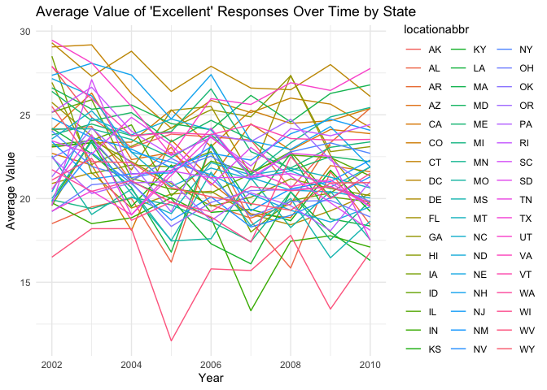
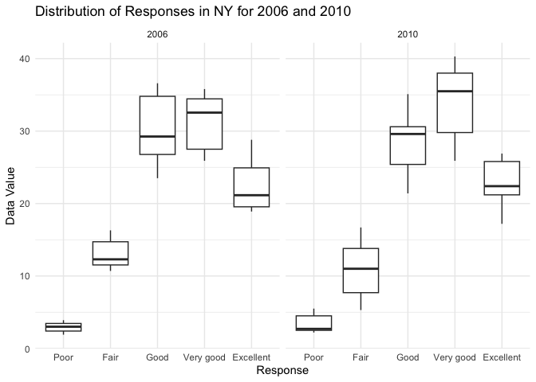
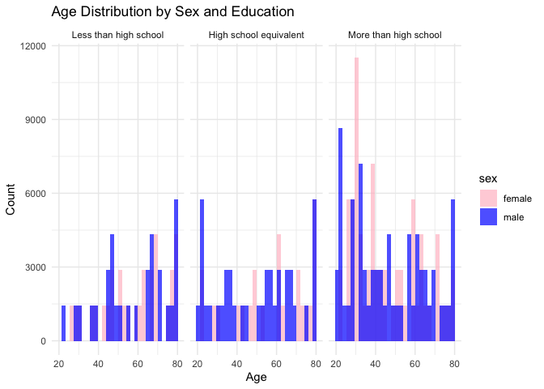
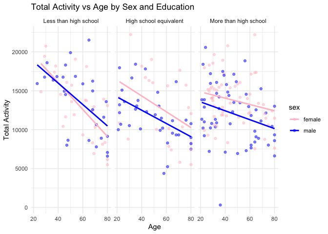
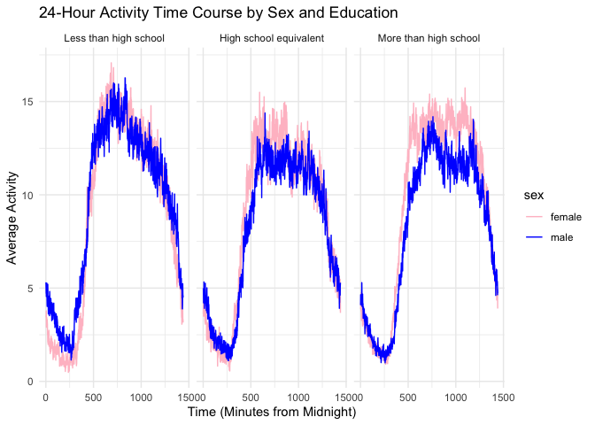

p8105_hw3_sw3737
================
sw3737
2023-10-14

## Problem 2

# Data import

``` r
library(p8105.datasets)
data("brfss_smart2010")
```

# Data cleaning

``` r
brfss_clean <- brfss_smart2010 %>% 
  janitor::clean_names() %>%
  filter(topic == "Overall Health", 
         response %in% c("Excellent", "Very good", "Good", "Fair", "Poor")) %>% 
  mutate(response = factor(response, levels = c("Poor", "Fair", "Good", "Very good", "Excellent")))
```

# State analysis for 2002 and 2010

``` r
brfss_clean %>%
  group_by(year, locationabbr) %>%
  summarise(counties = n_distinct(locationdesc)) %>%
  filter((year == 2002 | year == 2010) & counties >= 7)
```

    ## `summarise()` has grouped output by 'year'. You can override using the
    ## `.groups` argument.

    ## # A tibble: 20 × 3
    ## # Groups:   year [2]
    ##     year locationabbr counties
    ##    <int> <chr>           <int>
    ##  1  2002 CT                  7
    ##  2  2002 FL                  7
    ##  3  2002 MA                  8
    ##  4  2002 NC                  7
    ##  5  2002 NJ                  8
    ##  6  2002 PA                 10
    ##  7  2010 CA                 12
    ##  8  2010 CO                  7
    ##  9  2010 FL                 41
    ## 10  2010 MA                  9
    ## 11  2010 MD                 12
    ## 12  2010 NC                 12
    ## 13  2010 NE                 10
    ## 14  2010 NJ                 19
    ## 15  2010 NY                  9
    ## 16  2010 OH                  8
    ## 17  2010 PA                  7
    ## 18  2010 SC                  7
    ## 19  2010 TX                 16
    ## 20  2010 WA                 10

Comments: In 2002, 6 states were observed at 7 or more locations (CT,
FL, MA, NC, NJ, PA). In 2010, 14 states were observed at 7 or more
locations (CA, CO, FL, MA, MD, NC, NE, NJ, NY, OH, PA, SC, TX, WA).

# Construct a dataset

``` r
excellent_data <- brfss_clean %>% 
  filter(response == "Excellent") %>%
  group_by(year, locationabbr) %>%
  summarise(avg_data_value = mean(data_value, na.rm = TRUE), .groups = "drop")

ggplot(excellent_data, aes(x = year, y = avg_data_value, group = locationabbr, color = locationabbr)) +
  geom_line() +
  labs(title = "Average Value of 'Excellent' Responses Over Time by State",
       x = "Year", y = "Average Value") +
  theme_minimal() 
```

<!-- -->

Comments: The “spaghetti” plot illustrates the average value of
“Excellent” responses over time for each state, spanning the years 2002
to 2010. The graph is populated with a multitude of colorful lines, each
representing a different state, showcasing the variation in responses
over the years. Many states exhibit fluctuating trends, indicating
changes in the perception of what constitutes an “Excellent” response.

# Two-Panel Plot for 2006 and 2010

``` r
ny_data <- brfss_clean %>% 
  filter(locationabbr == "NY", year %in% c(2006, 2010))

ggplot(ny_data, aes(x = response, y = data_value)) +
  geom_boxplot() +
  facet_wrap(~ year) +
  labs(title = "Distribution of Responses in NY for 2006 and 2010",
       x = "Response", y = "Data Value") +
  theme_minimal()
```

<!-- -->

Comments: These two-panel plots show the distribution of `data_value`
for responses from `poor` to `excellent` among locations in NY State. In
2006, the median value for `Good` and `Very good` responses is
relatively high, while by 2010, the median for these categories has
slightly decreased. Conversely, the `Excellent` category saw a rise in
its median value from 2006 to 2010. This suggests a shift in the
distribution of responses over this four-year period in New York.

## Problem 3

# Demographics data cleaning

``` r
nhanes_covar <- read_csv("Data files/nhanes_covar.csv", skip = 4) %>%
  janitor::clean_names() %>% 
  mutate(
    sex = recode(sex, "1" = "male", "2" = "female"),
    education = recode(education, 
                       "1" = "Less than high school",
                       "2" = "High school equivalent",
                       "3" = "More than high school")
  ) %>%
  filter(age >= 21 & 
         !is.na(sex) & 
         !is.na(age) & 
         !is.na(bmi) & 
         !is.na(education))
```

    ## Rows: 250 Columns: 5
    ## ── Column specification ────────────────────────────────────────────────────────
    ## Delimiter: ","
    ## dbl (5): SEQN, sex, age, BMI, education
    ## 
    ## ℹ Use `spec()` to retrieve the full column specification for this data.
    ## ℹ Specify the column types or set `show_col_types = FALSE` to quiet this message.

# Accelerometer data cleaning and merge the two datasets

``` r
nhanes_accel <- read_csv("Data files/nhanes_accel.csv") %>%
  janitor::clean_names() %>%
  pivot_longer(
    min1:min1440,
    names_to = "min",
    values_to = "min_value"
  ) %>%
  separate(min, into = c("prefix","min"), sep = 3) %>%
  select(-prefix)
```

    ## Rows: 250 Columns: 1441
    ## ── Column specification ────────────────────────────────────────────────────────
    ## Delimiter: ","
    ## dbl (1441): SEQN, min1, min2, min3, min4, min5, min6, min7, min8, min9, min1...
    ## 
    ## ℹ Use `spec()` to retrieve the full column specification for this data.
    ## ℹ Specify the column types or set `show_col_types = FALSE` to quiet this message.

``` r
merged_data <- inner_join(nhanes_accel, nhanes_covar, by = "seqn") %>%
    mutate(education = factor(education, levels = c("Less than high school", "High school equivalent", "More than high school")))
```

# Table of number of men and women in each education category

``` r
table_data <- merged_data %>% 
  group_by(education, sex) %>% 
  summarise(count = n())
```

    ## `summarise()` has grouped output by 'education'. You can override using the
    ## `.groups` argument.

``` r
table_data
```

    ## # A tibble: 6 × 3
    ## # Groups:   education [3]
    ##   education              sex    count
    ##   <fct>                  <chr>  <int>
    ## 1 Less than high school  female 40320
    ## 2 Less than high school  male   38880
    ## 3 High school equivalent female 33120
    ## 4 High school equivalent male   50400
    ## 5 More than high school  female 84960
    ## 6 More than high school  male   80640

Comments: It displays a tabulated count of individuals based on their
education level and gender. It highlights three education categories:
`Less than high school`, `High school equivalent`, and
`More than high school`. For `Less than high school` and
`More than high school level`, females tend to have slightly higher
counts than males.

# Visualization of age distributions for men and women in each education category

``` r
ggplot(merged_data, aes(x = age, fill = sex)) +
  geom_histogram(alpha = 0.7, position = "identity") +
  facet_wrap(~education) +
  labs(title = "Age Distribution by Sex and Education",
       x = "Age",
       y = "Count") +
  theme_minimal() +
  scale_fill_manual(values = c("male" = "blue", "female" = "pink"))
```

    ## `stat_bin()` using `bins = 30`. Pick better value with `binwidth`.

<!-- -->

Comments: It illustrates the age distribution of individuals categorized
by sex and education. It’s observed that for the `Less than high school`
education category, the
`highest counts are concentrated around the age range of 60-80 years`.
While for the `More than high school` category, there’s a
`significant rise in counts for females between the ages of 20-40`. The
chart provides a visual representation of how age and educational
attainment intersect with gender.

# Plot of total activities vs age

``` r
total_activity_data <- merged_data %>%
  group_by(seqn, age, sex, education) %>%
  summarise(total_activity = sum(min_value, na.rm = TRUE))
```

    ## `summarise()` has grouped output by 'seqn', 'age', 'sex'. You can override
    ## using the `.groups` argument.

``` r
ggplot(total_activity_data, aes(x = age, y = total_activity, color = sex)) +
  geom_point(alpha = 0.5) +
  geom_smooth(method = "lm", se = FALSE) +
  facet_wrap(~education) +
  labs(title = "Total Activity vs Age by Sex and Education",
       x = "Age",
       y = "Total Activity") +
  theme_minimal() +
  scale_color_manual(values = c("male" = "blue", "female" = "pink"))
```

    ## `geom_smooth()` using formula = 'y ~ x'

<!-- -->

Comments: There is a
`declining trend in total activity with increasing age across all education levels`.
In all three education categories,
`females generally have a higher total activity level` than males across
various age groups. The decline in activity with age seems steeper for
those with `Less than high school` education as compared to the other
two categories.

# 24-Hour activity time courses plot

``` r
activity_time_course <- merged_data %>%
  group_by(min, education, sex) %>%
  summarise(avg_activity = mean(min_value, na.rm = TRUE))
```

    ## `summarise()` has grouped output by 'min', 'education'. You can override using
    ## the `.groups` argument.

``` r
ggplot(activity_time_course, aes(x = as.numeric(min), y = avg_activity, color = sex)) +
  geom_line() +
  facet_wrap(~education) +
  labs(title = "24-Hour Activity Time Course by Sex and Education",
       x = "Time (Minutes from Midnight)",
       y = "Average Activity") +
  theme_minimal() +
  scale_color_manual(values = c("male" = "blue", "female" = "pink"))
```

<!-- -->

Comments: The graph seems to follow a `diurnal rhythm`, where there’s an
increase in activity during the day and a decrease during the nighttime
for all education levels. The peaks of activity occur approximately at
mid-day. In all three education categories,
`females tend to have higher activity levels during the day` as compared
to males.There is very `minimal activity during the late-night hours`
for all groups, indicating that most participants are likely at rest or
sleeping.
